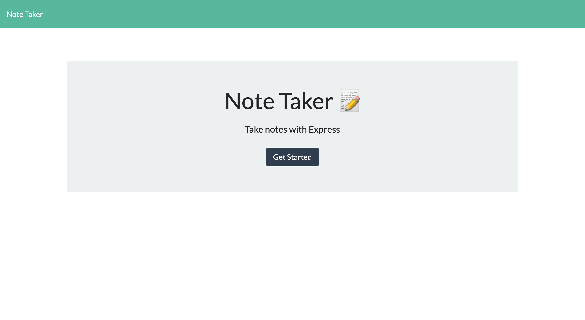
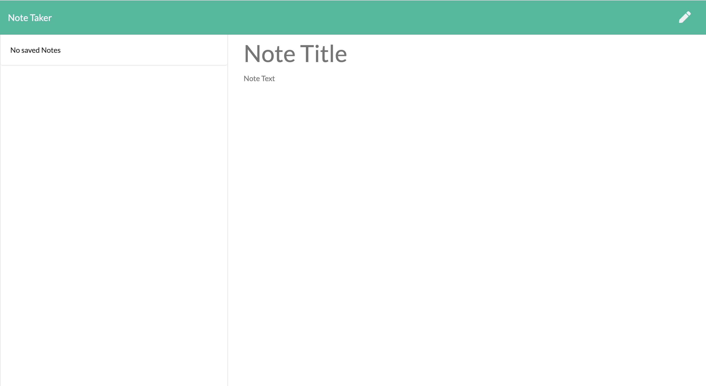
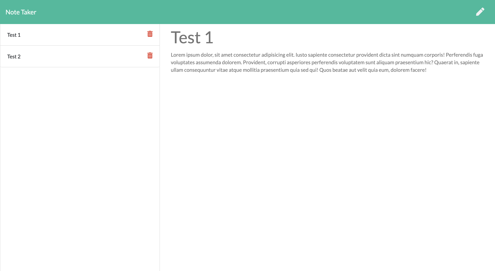
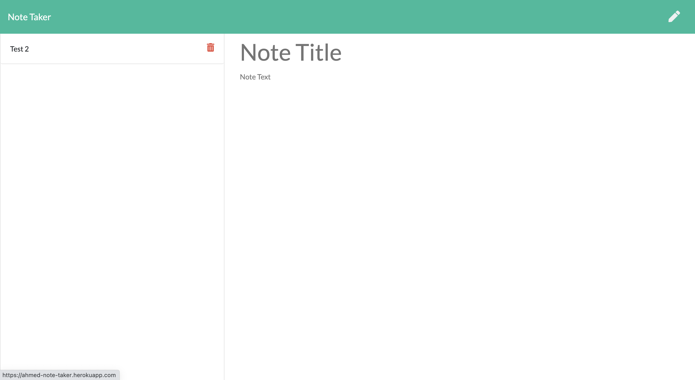

# Note-Taker

## Description
This node server side application is developed for the users to write, save and delete notes. The `Express.js` framework is used for quickly and easily establish our API routes and associated HTTP request methods.
## Installation
        
        Clone the repository to your local machine and install npm and run server.js from your terminal.

## Usage
#### Home page 

#### Note Page

#### Adding tow Notes

#### Deleting Notes

* Here You can run the application [Heroku Application](https://ahmed-note-taker.herokuapp.com/)
## How To
* This application can show the overall framework what the full stack web development looks like except we do not have a persistent database to store our data rather we store the our data inside our `db.json` file as an array object.
* When the user visits the link for the first time our html routes will be sent. The `index.html` which has taken us our home page will be loaded and once the user clicks the `Get-Started` button the next html page will be loaded which has a path `/notes` in our URL.
* The client- side code in our `index.js` file is responsible to handle how user inputs i.e `Note title and Text` data is sent to our express server In essence, when the user clicks save button after inserting any inputs, jQuery grabs all of the fields then sends a post request to our api routes which is `/api/notes` and our server saves the data to the our data array as a json file. Here we assign dynamically a`Unique id` for each data entry object so our server enables to listen and respond the deleting request method which the user wants to delete a specific resource.
* All the saved data will be rendered in the list-item and our renderNotes() function handles this tasks from our client-side basic JavaScript code. So behind the scene when the user makes the `GET` request, data will be "download" from our server after the AJAX function uses the URL of our API i.e `api/notes` to get that data associated with it.
* When a user wants to delete a note written before, the delete request method takes over and our AJAX function uses the URL of our API i.e  `/api/notes/:id` which we build our endpoint by passing a dynamic route which it takes whatever the user pass in the URL and setting that value to equal to a property in the params object. So based on this scenario we can have and sort out which note to be deleted or removed from our db.json file.Should receive a query parameter containing the id of a note to delete. 
* The `Insomnia` program is used to test our API routes.

## Tests
none